# 5/9 robomme env 分布审查

全部使用 easy medium hard 各100episode 不进行实际rollout（影响分布）
---

## MoveCube

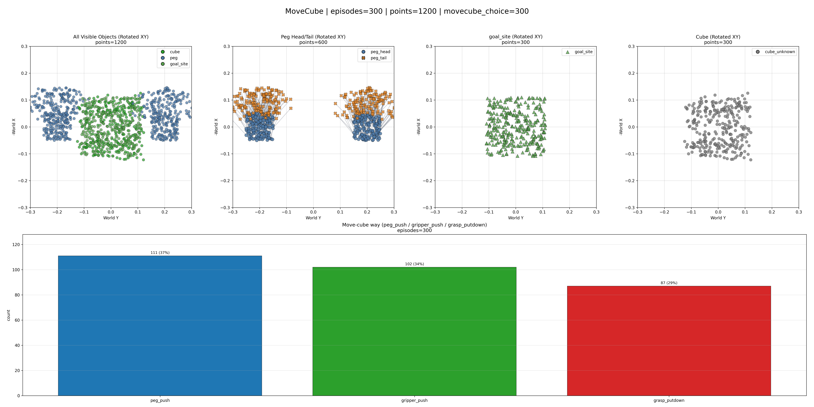

1. **第 1 行第 1 列** — cube + peg + goal_site xy 总览。
2. **第 1 行第 2 列** — peg head / tail xy。
3. **第 1 行第 3 列** — goal site xy。
4. **第 1 行第 4 列** — cube 起始 xy。
5. **第 2 行（跨 4 列）** — 任务完成分方式peg_push / gripper_push / grasp_putdown 计数。

---

## InsertPeg

1. **第 1 行第 1 列** — peg + box_with_hole xy 总览。
2. **第 1 行第 2 列** — peg head / tail xy。
3. **第 1 行第 3 列** — box_with_hole xy。
4. **第 2 行第 1 列** — 插入方向 left / right 计数。
5. **第 2 行第 2 列** — 插入端 head / tail 计数。
6. **第 2 行第 3 列** — 选中插入端 xy。

---

## PatternLock

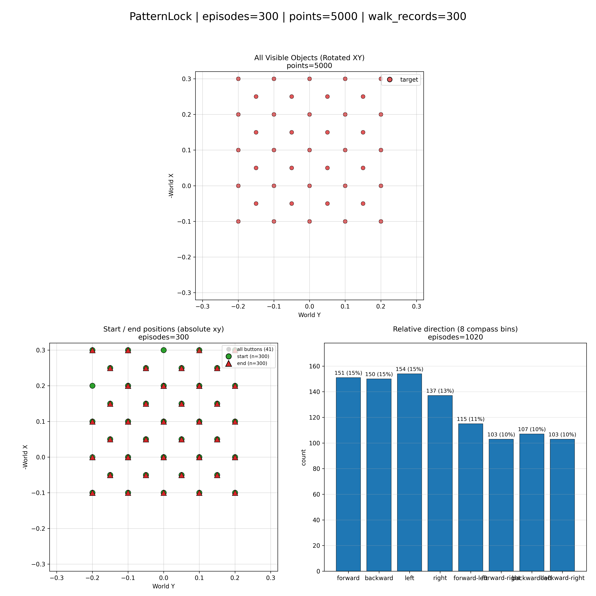

1. **第 1 行（跨整行）** — target 按钮点位汇总。
2. **第 2 行第 1 列** — 任务 起点 / 终点。
3. **第 2 行第 2 列** — 相邻两步相对方向 8 方向计数。

---

## RouteStick

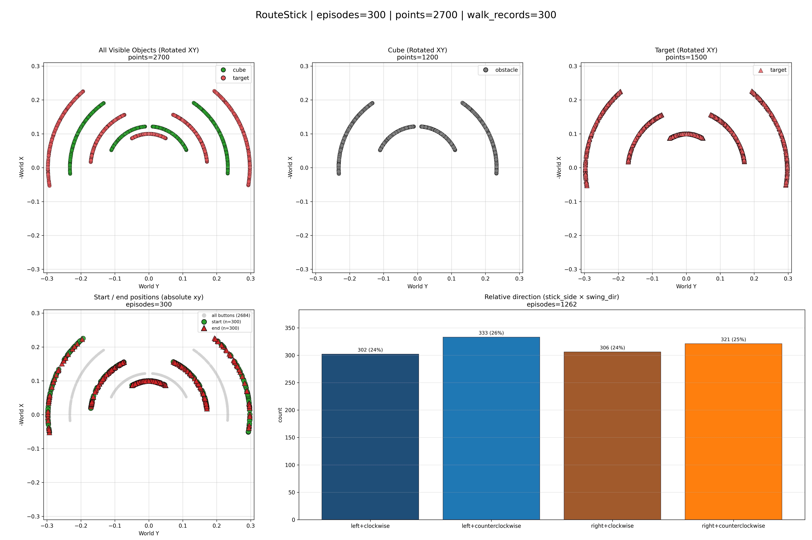

1. **第 1 行第 1 列** — obstacle + target xy 总览。
2. **第 1 行第 2 列** — obstacle xy。
3. **第 1 行第 3 列** — target xy。
4. **第 2 行第 1 列** — 任务 起点 / 终点。
5. **第 2 行第 2 列** — left/right × clockwise/counterclockwise 4 组合计数。

---

## PickHighlight

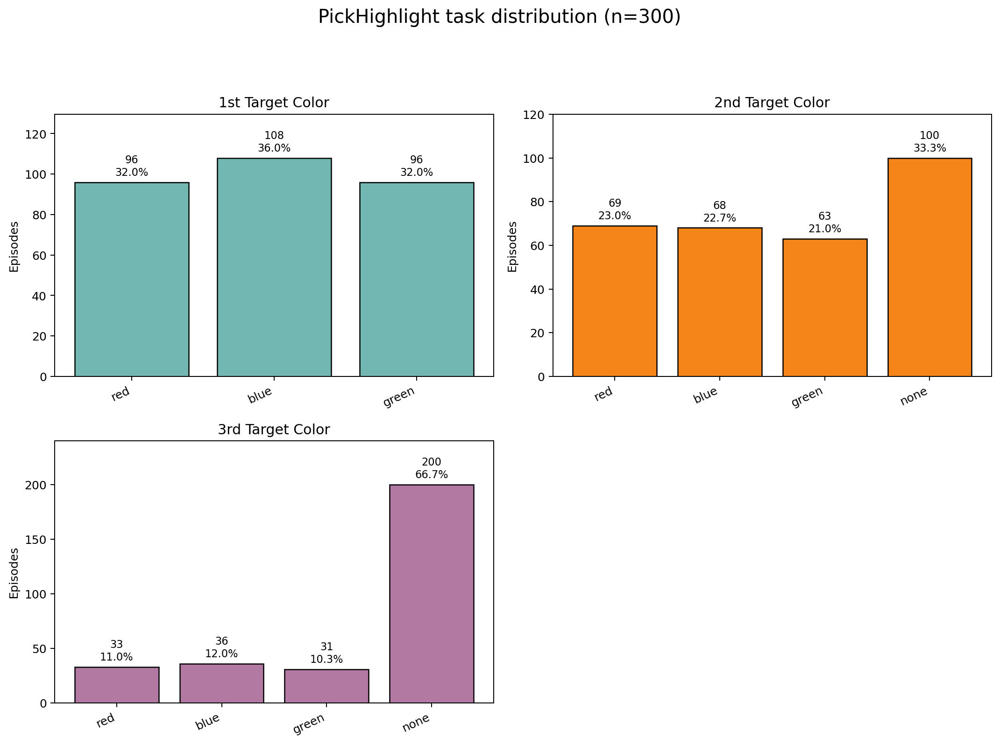

1. **第 1 行第 1 列** — 第 1 个 highlight target 颜色。
2. **第 1 行第 2 列** — 第 2 个 highlight target 颜色。
3. **第 2 行第 1 列** — 第 3 个 highlight target 颜色。

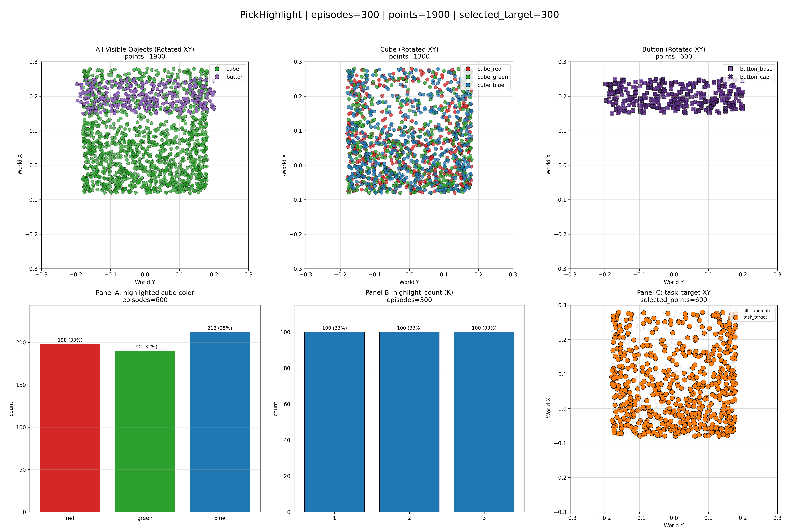

1. **第 1 行第 1 列** — cube + button xy 总览。
2. **第 1 行第 2 列** — cube 按颜色 xy。
3. **第 1 行第 3 列** — button xy。
4. **第 2 行第 1 列** — 所有 episode 累计颜色计数。
5. **第 2 行第 2 列** — 每个 episoode 需要pickup的数量。
6. **第 2 行第 3 列** — 选中 需要pickup的 cube xy。

---

## VideoPlaceButton

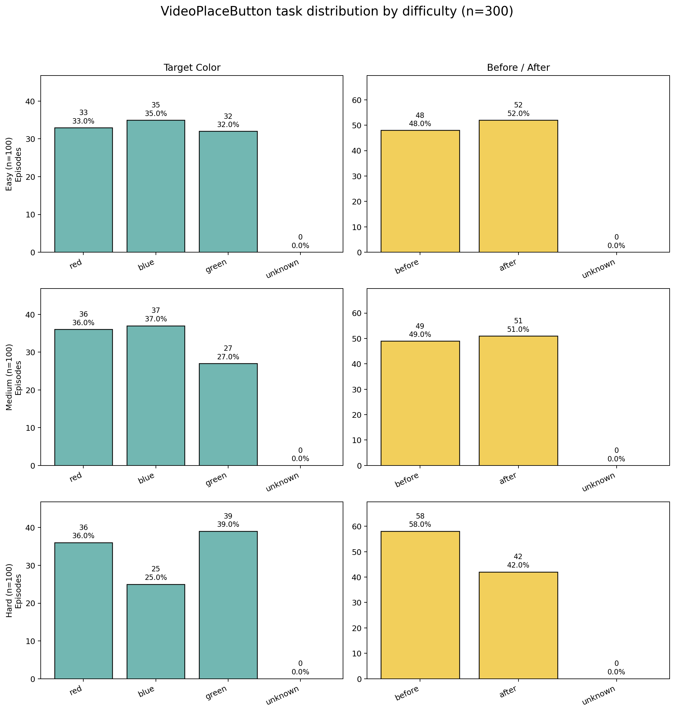

**分难度审查**：

1. **第 1 行第 1 列** — target cube 颜色。
2. **第 1 行第 2 列** — task goal 是第几个。
3. **第 2 行第 1 列** — target cube 颜色。
4. **第 2 行第 2 列** — task goal 是第几个。
5. **第 3 行第 1 列** — target cube 颜色。
6. **第 3 行第 2 列** — task goal 是第几个。

1. **第 1 行第 1 列** — cube + button + target xy 总览。
2. **第 1 行第 2 列** — cube 按颜色 xy。
3. **第 1 行第 3 列** — button xy。
4. **第 1 行第 4 列** — target xy。
5. **第 2 行第 1 列** — before / after 计数。
6. **第 2 行第 2 列** — 选中 target 是哪一个。
7. **第 2 行第 3 列** — 选中 target xy。
8. **第 3 行（跨整行）** — swap_pair xy 连线。

---

## VideoPlaceOrder

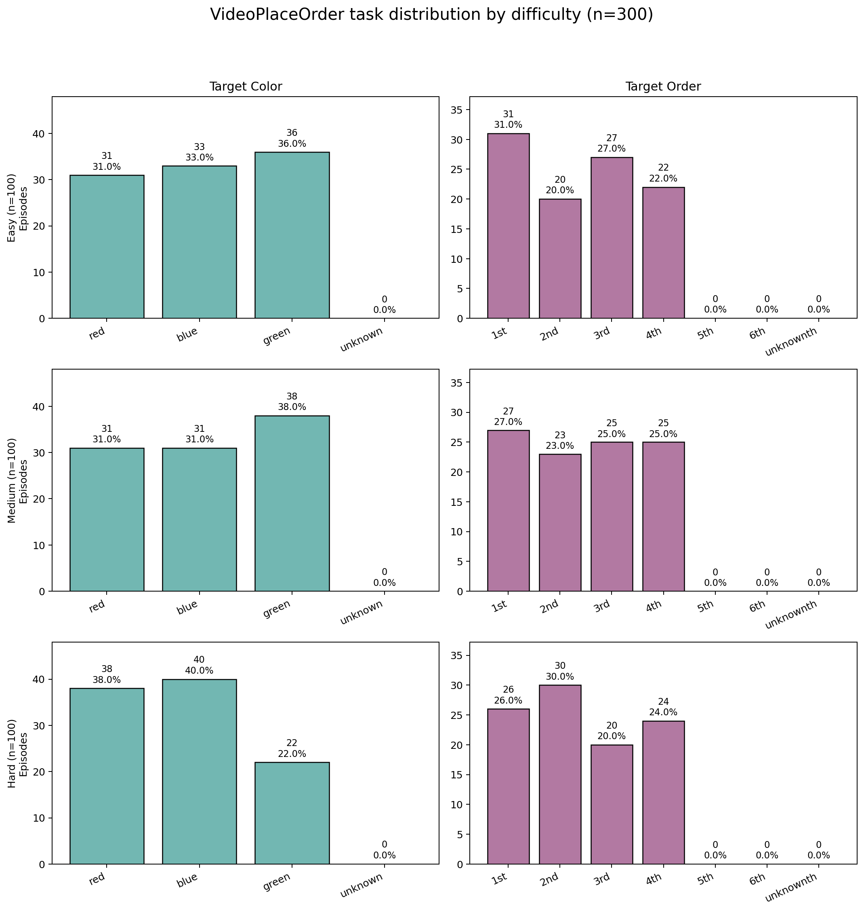

**分难度审查**：

1. **第 1 行第 1 列** — target cube 颜色。
2. **第 1 行第 2 列** — target 在 reference 序列中的次序（1st-6th）。
3. **第 2 行第 1 列** — target cube 颜色。
4. **第 2 行第 2 列** — target 次序槽位。
5. **第 3 行第 1 列** — target cube 颜色。
6. **第 3 行第 2 列** — target 次序槽位。

1. **第 1 行第 1 列** — cube + button + target xy 总览。
2. **第 1 行第 2 列** — cube 按颜色 xy。
3. **第 1 行第 3 列** — button xy。
4. **第 1 行第 4 列** — target xy。
5. **第 2 行第 1 列** — target 在 reference 序列中的次序计数。
6. **第 2 行第 2 列** — target_index 计数。
7. **第 2 行第 3 列** — 选中 target xy。
8. **第 3 行（跨整行）** — swap_pair xy 连线。

---

## VideoRepick

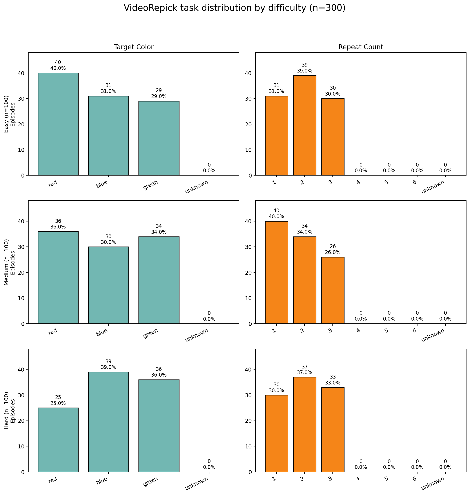

**分难度审查**：

1. **第 1 行第 1 列** — target cube 颜色。
2. **第 1 行第 2 列** — target cube 重复拾取次数。
3. **第 2 行第 1 列** — target cube 颜色。
4. **第 2 行第 2 列** — target cube 重复拾取次数。
5. **第 3 行第 1 列** — target cube 颜色。
6. **第 3 行第 2 列** — target cube 重复拾取次数。

1. **第 1 行第 1 列** — 全部可见对象 xy 总览。
2. **第 1 行第 2 列** — button xy。
3. **第 2 行（跨整行）** — pickup target xy（按颜色拆）。
4. **第 3 行（跨整行）** — swap pair xy 连线。

---

## BinFill

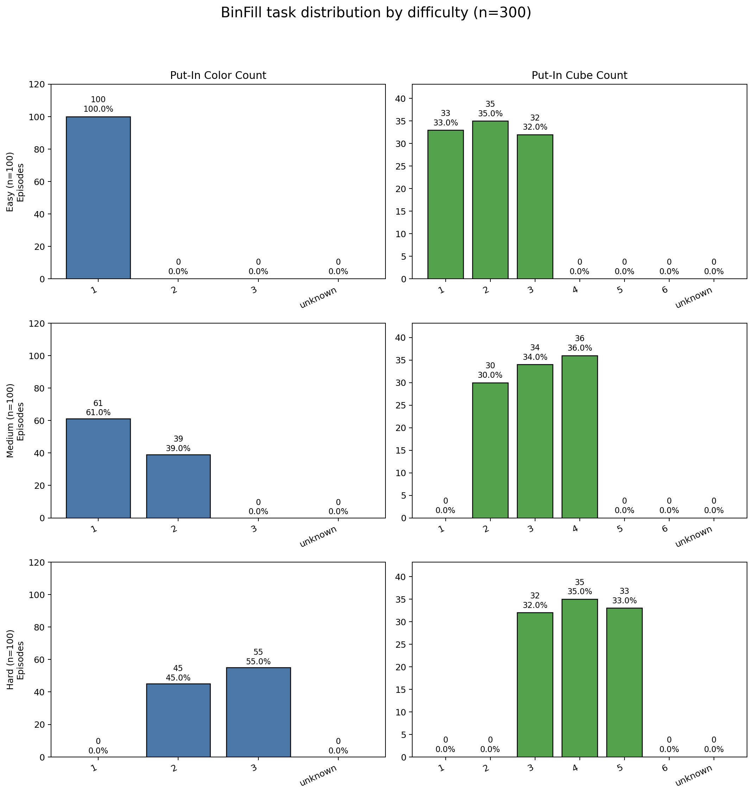

**分难度审查**：

1. **第 1 行第 1 列** — 装入 bin 的颜色种数。
2. **第 1 行第 2 列** — 装入 cube 总数。
3. **第 2 行第 1 列** — 装入 bin 的颜色种数。
4. **第 2 行第 2 列** — 装入 cube 总数。
5. **第 3 行第 1 列** — 装入 bin 的颜色种数。
6. **第 3 行第 2 列** — 装入 cube 总数。

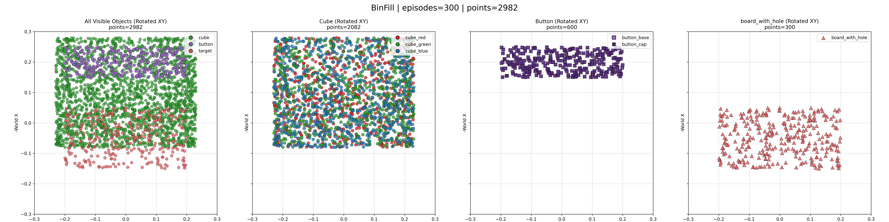

1. **第 1 行第 1 列** — cube + button + board_with_hole xy 总览。
2. **第 1 行第 2 列** — cube 按颜色 xy。
3. **第 1 行第 3 列** — button xy。
4. **第 1 行第 4 列** — board_with_hole xy。

---

## PickXtimes

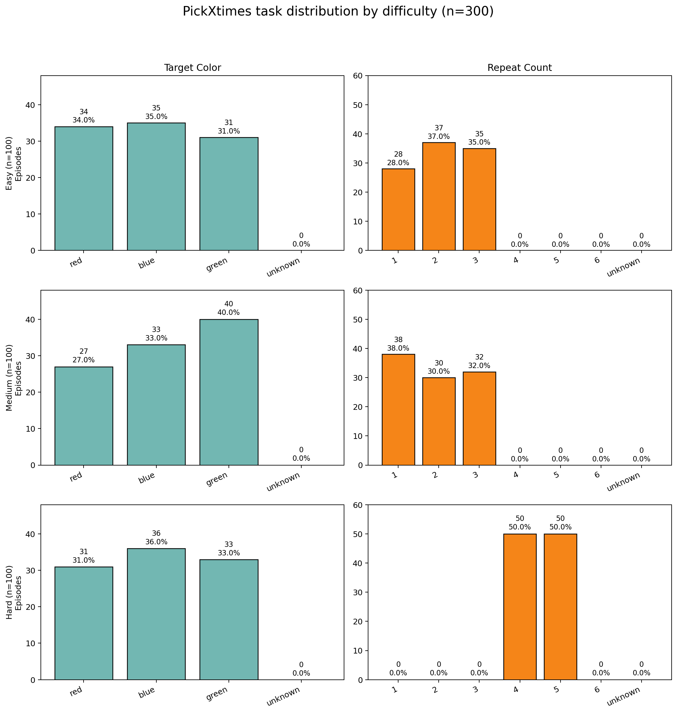

**分难度审查**：

1. **第 1 行第 1 列** — target cube 颜色。
2. **第 1 行第 2 列** — pick 次数。
3. **第 2 行第 1 列** — target cube 颜色。
4. **第 2 行第 2 列** — pick 次数。
5. **第 3 行第 1 列** — target cube 颜色。
6. **第 3 行第 2 列** — pick 次数。

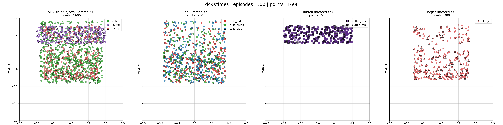

1. **第 1 行第 1 列** — cube + button + target xy 总览。
2. **第 1 行第 2 列** — cube 按颜色 xy。
3. **第 1 行第 3 列** — button xy。
4. **第 1 行第 4 列** — target xy。

---

## SwingXtimes

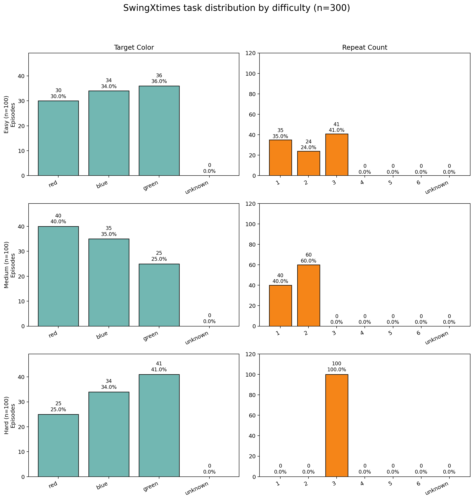

**分难度审查**：

1. **第 1 行第 1 列** — target cube 颜色。
2. **第 1 行第 2 列** — swing 次数。
3. **第 2 行第 1 列** — target cube 颜色。
4. **第 2 行第 2 列** — swing 次数。
5. **第 3 行第 1 列** — target cube 颜色。
6. **第 3 行第 2 列** — swing 次数。

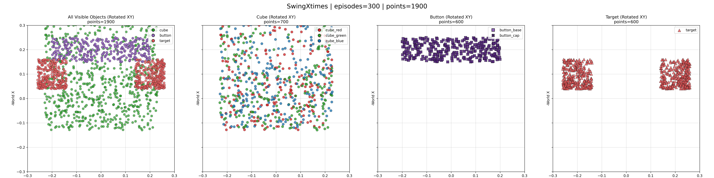

1. **第 1 行第 1 列** — cube + button + target xy 总览。
2. **第 1 行第 2 列** — cube 按颜色 xy。
3. **第 1 行第 3 列** — button xy。
4. **第 1 行第 4 列** — target xy。

---

## StopCube

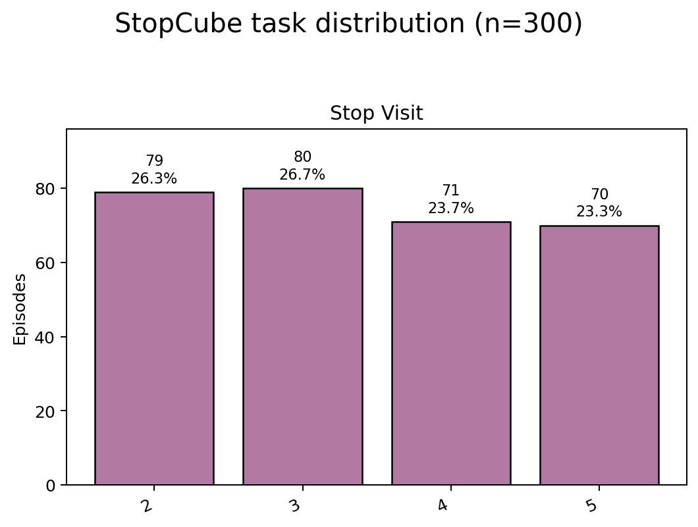

1. **第 1 行第 1 列** — stop visit 槽位。

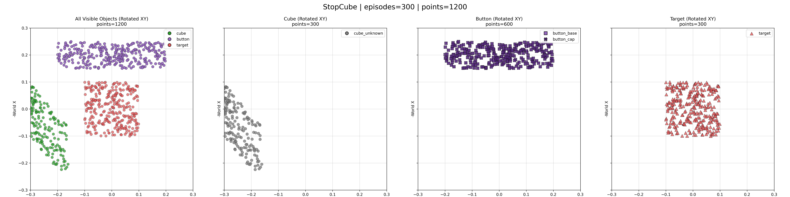

1. **第 1 行第 1 列** — cube + button + target xy 总览。
2. **第 1 行第 2 列** — cube xy。
3. **第 1 行第 3 列** — button xy。
4. **第 1 行第 4 列** — target xy。

---

## VideoUnmask

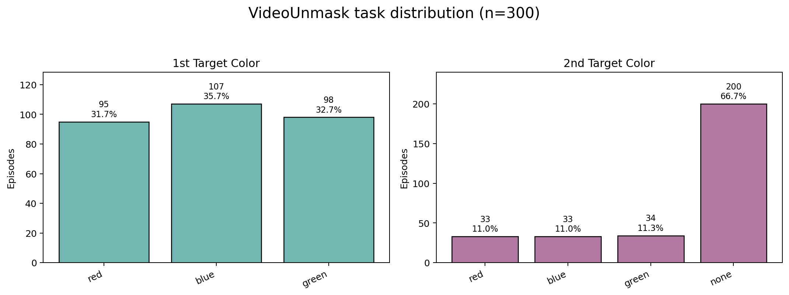

1. **第 1 行第 1 列** — 第 1 个 pickup target 颜色。
2. **第 1 行第 2 列** — 第 2 个 pickup target 颜色。

1. **第 1 行第 1 列** — 全部可见对象 xy 总览。
2. **第 1 行第 2 列** — cube xy。
3. **第 1 行第 3 列** — button xy。
4. **第 1 行第 4 列** — bin xy 按 bin_index 着色。
5. **第 2 行第 1 列** — cubes 按颜色 xy。
6. **第 3 行第 1 列** — 第 1 次 pickup bin xy。
7. **第 3 行第 2 列** — 第 2 次 pickup bin xy。
8. **第 3 行第 3 列** — 第 1 次 pickup bin index 计数。
9. **第 3 行第 4 列** — 第 2 次 pickup bin index 计数。

---

## VideoUnmaskSwap

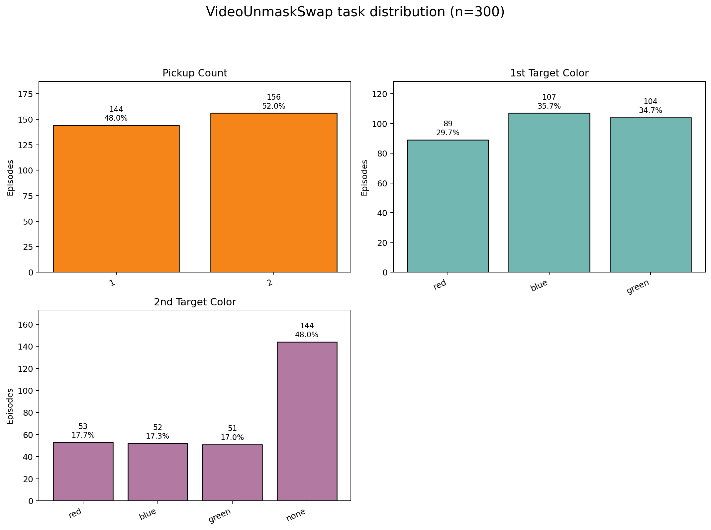

1. **第 1 行第 1 列** — pickup 次数。
2. **第 1 行第 2 列** — 第 1 个 target 颜色。
3. **第 2 行第 1 列** — 第 2 个 target 颜色。

1. **第 1 行第 1 列** — 全部可见对象 xy 总览。
2. **第 1 行第 2 列** — cube xy。
3. **第 1 行第 3 列** — button xy。
4. **第 1 行第 4 列** — bin xy 按 bin_index 着色。
5. **第 2 行第 1 列** — cubes 按颜色 xy。
6. **第 2 行第 2 列** — swap 两端 bin 双向箭头。
7. **第 2 行第 3 列** — 3-bin 共现频率热图。
8. **第 2 行第 4 列** — 4-bin 共现频率热图。
9. **第 3 行第 1 列** — 第 1 次 pickup bin xy。
10. **第 3 行第 2 列** — 第 2 次 pickup bin xy。
11. **第 3 行第 3 列** — 第 1 次 pickup bin index 计数。
12. **第 3 行第 4 列** — 第 2 次 pickup bin index 计数。

---

## ButtonUnmask

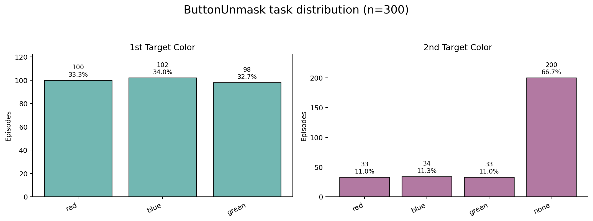

1. **第 1 行第 1 列** — 第 1 个 target 颜色。
2. **第 1 行第 2 列** — 第 2 个 target 颜色。

1. **第 1 行第 1 列** — 全部可见对象 xy 总览。
2. **第 1 行第 2 列** — cube xy。
3. **第 1 行第 3 列** — button xy。
4. **第 1 行第 4 列** — bin xy 按 bin_index 着色。
5. **第 2 行第 1 列** — cubes 按颜色 xy。
6. **第 3 行第 1 列** — 第 1 次 pickup bin xy。
7. **第 3 行第 2 列** — 第 2 次 pickup bin xy。
8. **第 3 行第 3 列** — 第 1 次 pickup bin index 计数。
9. **第 3 行第 4 列** — 第 2 次 pickup bin index 计数。

---

## ButtonUnmaskSwap

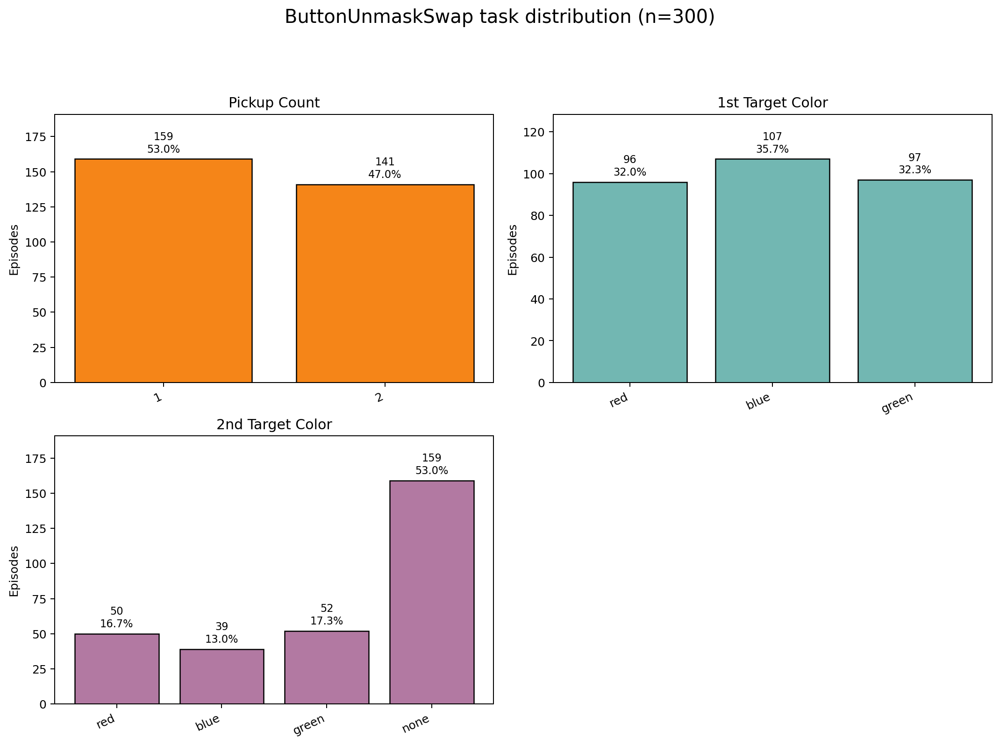

1. **第 1 行第 1 列** — pickup 次数。
2. **第 1 行第 2 列** — 第 1 个 target 颜色。
3. **第 2 行第 1 列** — 第 2 个 target 颜色。

1. **第 1 行第 1 列** — 全部可见对象 xy 总览。
2. **第 1 行第 2 列** — cube xy。
3. **第 1 行第 3 列** — button xy。
4. **第 1 行第 4 列** — bin xy 按 bin_index 着色。
5. **第 2 行第 1 列** — cubes 按颜色 xy。
6. **第 2 行第 2 列** — swap 两端 bin 双向箭头。
7. **第 2 行第 3 列** — 3-bin 共现频率热图。
8. **第 2 行第 4 列** — 4-bin 共现频率热图。
9. **第 3 行第 1 列** — 第 1 次 pickup bin xy。
10. **第 3 行第 2 列** — 第 2 次 pickup bin xy。
11. **第 3 行第 3 列** — 第 1 次 pickup bin index 计数。
12. **第 3 行第 4 列** — 第 2 次 pickup bin index 计数。
