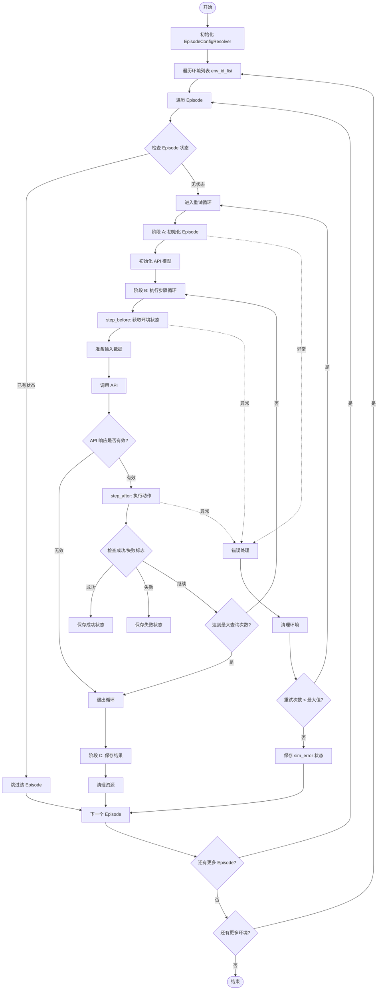
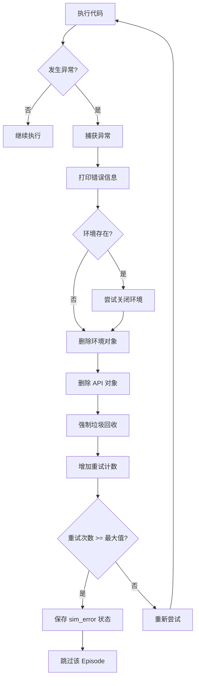
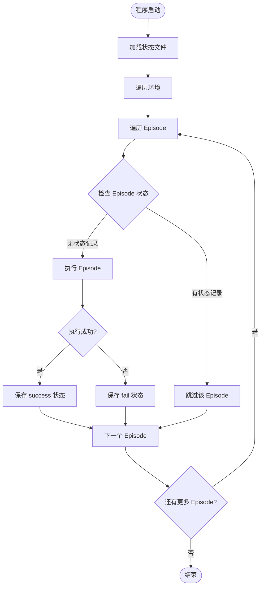
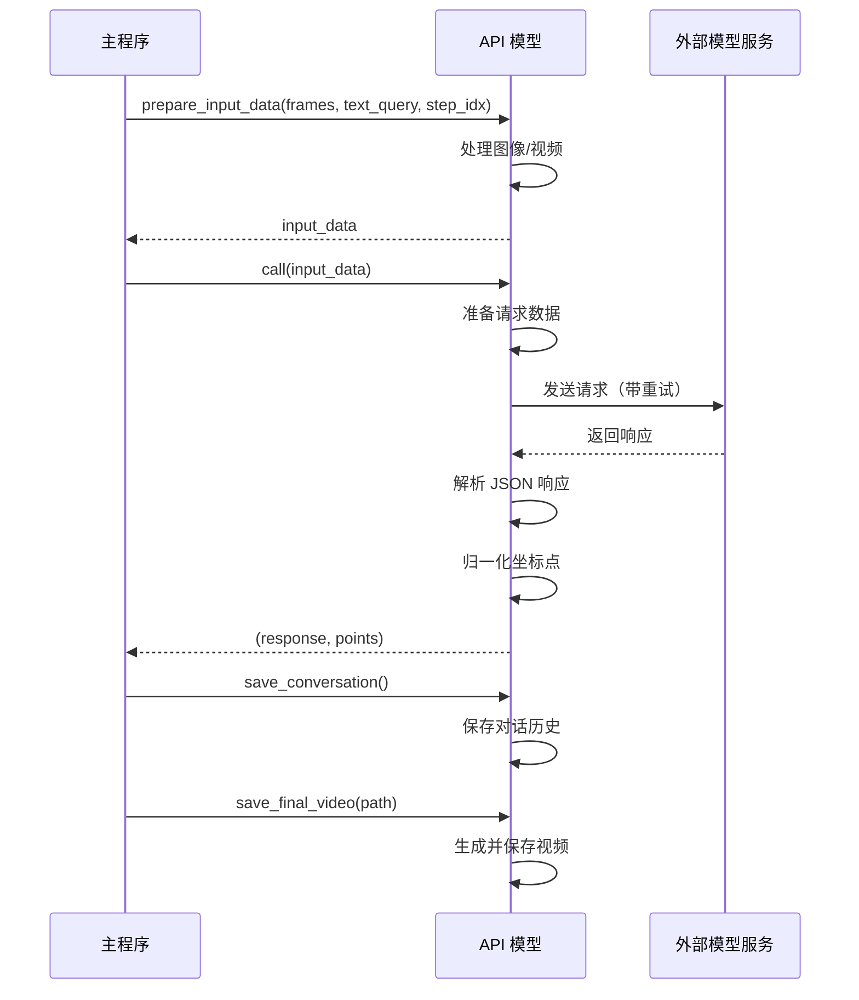

# Oracle V4 参数设置与运行文档

## 目录

1. [概述](#概述)
2. [参数配置](#参数配置)
3. [运行流程](#运行流程)
4. [错误处理机制](#错误处理机制)
5. [断点续传功能](#断点续传功能)
6. [API 集成](#api-集成)
7. [使用示例](#使用示例)

---

## 概述

Oracle V4 是一个基于 Episode 级错误处理的机器人任务规划系统。其核心设计理念是将**整个 Episode 视为一个原子操作**，通过分层错误处理机制确保任务执行的稳定性。

### 核心设计理念

Oracle V4 将错误分为两类：

1. **软错误（Soft Failures）**
   - 类型：API 超时、网络波动等临时性问题
   - 策略：原地等待并重试（由 API 类内部处理）
   - 特点：不需要重建环境

2. **硬错误（Hard Failures）**
   - 类型：`step_before/after` 报错、环境初始化失败、规划器错误、关键数据准备失败
   - 策略：销毁环境，重新开始当前 Episode
   - 特点：需要完全重建环境

### 架构特点

- **Episode 级保护**：在遍历 episode 的循环内部，建立"尝试-销毁-重建"机制
- **状态持久化**：通过 JSON 文件记录每个 episode 的执行状态，支持断点续传
- **多模型支持**：支持 Gemini、OpenAI、Qwen、Local 等多种视觉语言模型
- **任务自适应**：根据任务类型自动选择不同的提示模板和查询策略

### 关键文件

- **主文件**：[`oraclev4.py`](oraclev4.py) - 主执行逻辑
- **逻辑实现**：[`oracle_logic.py`](oracle_logic.py) - `step_before` 和 `step_after` 函数
- **API 接口**：[`chat_api/api.py`](../chat_api/api.py) - 模型 API 封装
- **配置解析**：[`evaluate_oracle_planner_gui.py`](../../scripts/evaluate_oracle_planner_gui.py) - Episode 配置解析器

---

## 参数配置

### 主要参数列表

| 参数名 | 类型 | 默认值 | 位置 | 说明 |
|--------|------|--------|------|------|
| `gui_render` | `bool` | `False` | ```210:213:oraclev4.py
oracle_resolver = EpisodeConfigResolverForOraclePlanner(
    gui_render=False,
    max_steps_without_demonstration=1000
)
``` | 是否启用 GUI 渲染 |
| `max_steps_without_demonstration` | `int` | `1000` | 同上 | 无演示时的最大步数 |
| `env_id_list` | `List[str]` | `["BinFill"]` | ```215:235:oraclev4.py
env_id_list = [
    # "PickXtimes",
    # "StopCube",
    # "SwingXtimes",
     "BinFill",
    # ... 其他任务
]
``` | 要执行的环境任务列表 |
| `model_name` | `str` | `"gemini-2.5-pro"` | ```248:248:oraclev4.py
model_name = "gemini-2.5-pro"  # "gemini-2.5-pro" # "gpt-4o-mini", "gemini-er", "qwen-vl"， "local" 
``` | 使用的模型名称 |
| `max_episode_retries` | `int` | `3` | ```258:258:oraclev4.py
max_episode_retries = 3
``` | Episode 级最大重试次数 |
| `max_query_times` | `int` | `10` | ```290:290:oraclev4.py
max_query_times = 10
``` | 每个 episode 的最大查询次数 |
| `status_json_path` | `str` | `"/home/hongzefu/oracle_planning_results/episode_status.json"` | ```238:238:oraclev4.py
status_json_path = os.path.join("/home/hongzefu", "oracle_planning_results", "episode_status.json")
``` | 状态保存 JSON 文件路径 |
| `save_dir` | `str` | 动态生成 | ```249:249:oraclev4.py
save_dir = os.path.join("/home/hongzefu", "oracle_planning_results", model_name, env_id, f"ep{episode}")
``` | Episode 结果保存目录 |

### 环境任务列表

支持的环境任务包括：

```130:133:oraclev4.py
TASK_WITH_DEMO = [
    "VideoUnmask", "VideoUnmaskSwap", "VideoPlaceButton", "VideoPlaceOrder",
    "VideoRepick", "MoveCube", "InsertPeg", "PatternLock", "RouteStick"
]
```

这些任务在第一步会使用演示视频（demo）作为输入。

### 模型选择

支持的模型类型：

- **Gemini 系列**：`"gemini-2.5-pro"`, `"gemini-er"` 等
- **OpenAI 系列**：`"gpt-4o-mini"` 等
- **Qwen 系列**：`"qwen-vl"` 等
- **本地模型**：`"local"`

模型选择逻辑：

```278:285:oraclev4.py
if "gemini" in model_name:
    api = GeminiModel(save_dir=save_dir, task_id=env_id, model_name=model_name, task_goal=language_goal, subgoal_type="oracle_planner")
elif "qwen" in model_name:
    api = QwenModel(save_dir=save_dir, task_id=env_id, model_name=model_name, task_goal=language_goal, subgoal_type="oracle_planner")
elif "local" in model_name:
    api = LocalModel(save_dir=save_dir, task_id=env_id, model_name=model_name, task_goal=language_goal, subgoal_type="oracle_planner")
else:
    api = OpenAIModel(save_dir=save_dir, task_id=env_id, model_name=model_name, task_goal=language_goal, subgoal_type="oracle_planner")
```

### API 初始化参数

所有模型 API 都使用以下参数初始化：

- `save_dir`: 保存对话历史和图像的目录路径
- `task_id`: 任务标识符（如 `"PatternLock"`, `"BinFill"` 等）
- `model_name`: 模型名称或路径
- `task_goal`: 任务目标描述（从环境获取的语言目标）
- `subgoal_type`: 固定为 `"oracle_planner"`，表示使用 Oracle 规划器模式

---

## 运行流程

### 整体流程图



### 详细执行阶段

#### 阶段 A：初始化

```264:286:oraclev4.py
# 阶段 A：初始化
env, planner, color_map, language_goal = oracle_resolver.initialize_episode(env_id, episode)
success = "fail"

# 如果目录存在但未完成，删除并重新创建
if os.path.exists(save_dir):
    print(f"[断点继续] 检测到未完成的episode {episode}，删除旧文件重新开始")
    shutil.rmtree(save_dir)
os.makedirs(save_dir, exist_ok=True)

with open(os.path.join(save_dir, "language_goal.txt"), "w") as f:
    f.write(language_goal)

if "gemini" in model_name:
    api = GeminiModel(save_dir=save_dir, task_id=env_id, model_name=model_name, task_goal=language_goal, subgoal_type="oracle_planner")
elif "qwen" in model_name:
    api = QwenModel(save_dir=save_dir, task_id=env_id, model_name=model_name, task_goal=language_goal, subgoal_type="oracle_planner")
elif "local" in model_name:
    api = LocalModel(save_dir=save_dir, task_id=env_id, model_name=model_name, task_goal=language_goal, subgoal_type="oracle_planner")
else:
    api = OpenAIModel(save_dir=save_dir, task_id=env_id, model_name=model_name, task_goal=language_goal, subgoal_type="oracle_planner")
```

初始化步骤：
1. 调用 `oracle_resolver.initialize_episode()` 创建环境和规划器
2. 清理或创建保存目录
3. 保存语言目标到文件
4. 根据模型名称创建对应的 API 实例

#### 阶段 B：执行步骤循环

```296:401:oraclev4.py
# 阶段 B：执行步骤循环
while True:
    if step_idx >= max_query_times:
        print(f"Max query times ({max_query_times}) reached, stopping.")
        break

    # 步骤 1：执行 step_before
    seg_vis, seg_raw, base_frames, wrist_frames, available_options = step_before(
        env,
        planner,
        env_id,
        color_map
    )
    
    # 检查是否有新的帧可用
    if len(base_frames) <= frame_idx:
        print(f"Warning: No new frames available at step {step_idx}. Exiting loop.")
        raise Exception("No new frames available, triggering episode retry")
    
    # 步骤 2：准备查询文本
    if step_idx == 0:
        if env_id in TASK_WITH_DEMO:
            if api.use_multi_images_as_video:
                text_query = DEMO_TEXT_QUERY_multi_image.format(task_goal=language_goal)
            else:
                text_query = DEMO_TEXT_QUERY.format(task_goal=language_goal)
        else:
            text_query = IMAGE_TEXT_QUERY.format(task_goal=language_goal)
    else:
        if api.use_multi_images_as_video:
            text_query = VIDEO_TEXT_QUERY_multi_image.format(task_goal=language_goal)
        else:
            text_query = VIDEO_TEXT_QUERY.format(task_goal=language_goal)
    
    # 步骤 3：准备输入数据
    input_data = api.prepare_input_data(base_frames[frame_idx:], text_query, step_idx)

    # 步骤 4：API 调用
    response, points = api.call(input_data)
    
    if response is None:
        print("Response is None, skipping this step")
        break
    
    # 步骤 5：处理响应
    command_dict = response['subgoal']
    if command_dict['point'] is not None:
        command_dict['point'] = command_dict['point'][::-1]  # 坐标转换
    
    frame_idx = len(base_frames)
    step_idx += 1
    
    # 步骤 6：执行 step_after
    evaluation = step_after(
        env,
        planner,
        env_id,
        seg_vis,
        seg_raw,
        base_frames,
        wrist_frames,
        command_dict
    )
    
    # 步骤 7：判断结束
    fail_flag = evaluation.get("fail", False)
    success_flag = evaluation.get("success", False)
    
    if _tensor_to_bool(fail_flag):
        success = "fail"
        print("Encountered failure condition; stopping task sequence.")
        break

    if _tensor_to_bool(success_flag):
        success = "success"
        print("Task completed successfully.")
        break
```

步骤循环说明：
1. **step_before**：获取当前环境状态（分割图、帧序列、可用选项）
2. **准备查询**：根据步骤索引和任务类型选择查询模板
3. **准备输入**：将帧序列和查询文本转换为 API 输入格式
4. **API 调用**：调用模型 API 获取动作预测
5. **处理响应**：解析响应并转换坐标格式
6. **step_after**：执行动作并评估结果
7. **判断结束**：检查成功或失败标志

#### 阶段 C：保存结果

```403:421:oraclev4.py
# 阶段 C：成功标记
if response is not None:
    api.prepare_input_data(base_frames[frame_idx:], text_query, step_idx)
else:
    success = "api_error"

api.save_conversation()
api.save_final_video(os.path.join(os.path.dirname(save_dir), f"{success}_ep{episode}_{language_goal}.mp4"))
api.clear_uploaded_files() #only for gemini
del api
del env
# 记录状态（success或fail，api_error不记录）
if success in ["success", "fail"]:
    save_episode_status(status_json_path, model_name, env_id, episode, success)
break # Success break out of retry loop
```

保存步骤：
1. 保存对话历史（`api.save_conversation()`）
2. 保存最终视频（`api.save_final_video()`）
3. 清理上传的文件（仅 Gemini）
4. 删除 API 和环境对象
5. 保存 Episode 状态到 JSON 文件

---

## 错误处理机制

### 错误分类

#### 软错误（Soft Failures）

**定义**：临时性错误，不影响环境状态

**类型**：
- API 超时
- 网络波动
- 临时性 API 错误

**处理策略**：
- 由 API 类内部处理
- 原地等待并重试
- 不需要重建环境

**实现位置**：API 类的 `call()` 方法内部

#### 硬错误（Hard Failures）

**定义**：严重错误，可能导致环境状态不一致

**类型**：
- `step_before()` 报错
- `step_after()` 报错
- 环境初始化失败
- 规划器错误
- 关键数据准备失败（如帧数据为空）

**处理策略**：
- 捕获所有异常
- 销毁环境：`env.close()`, `del env`, `del api`
- 强制垃圾回收：`gc.collect()`
- 重建环境并重试（最多 `max_episode_retries` 次）

### 错误处理流程

```423:452:oraclev4.py
except Exception as e:
    # 进入 except 块（捕获环境/仿真崩溃）：
    print(f"Episode {episode} crashed on try {current_episode_try + 1}. Error: {e}")
    import traceback
    traceback.print_exc()
    
    # 关键动作：清理战场。
    if 'env' in locals() and env is not None:
        try:
            env.close()
        except:
            pass
    
    if 'api' in locals() and api is not None:
         # api cleanup if needed
         pass
    
    if 'env' in locals(): del env
    if 'api' in locals(): del api
    
    # 强制进行 Python 垃圾回收 gc.collect()（对仿真器很重要）。
    gc.collect()
    current_episode_try += 1
    
    # 判断是否放弃
    if current_episode_try >= max_episode_retries:
        print(f"Skipping episode {episode} due to persistent errors.")
        # 记录sim_error状态
        save_episode_status(status_json_path, model_name, env_id, episode, "sim_error")
        break
```

### 错误处理流程图



### 重试机制

- **重试计数器**：`current_episode_try`（从 0 开始）
- **最大重试次数**：`max_episode_retries = 3`
- **重试条件**：任何异常都会触发重试
- **放弃条件**：达到最大重试次数后，保存 `"sim_error"` 状态并跳过该 Episode

---

## 断点续传功能

### 功能概述

Oracle V4 支持断点续传功能，通过 JSON 文件记录每个 Episode 的执行状态。当程序中断后重新运行时，会自动跳过已完成的 Episode。

### 状态文件结构

状态文件路径：`/home/hongzefu/oracle_planning_results/episode_status.json`

状态文件格式：

```json
{
  "gemini-2.5-pro/BinFill/ep0": "success",
  "gemini-2.5-pro/BinFill/ep1": "fail",
  "gemini-2.5-pro/PatternLock/ep0": "sim_error"
}
```

状态值说明：
- `"success"`：Episode 成功完成
- `"fail"`：Episode 失败
- `"sim_error"`：Episode 因仿真错误而跳过
- `"api_error"`：API 错误（不记录到状态文件）

### 状态检查

```251:255:oraclev4.py
# 检查episode状态（断点继续）- 只使用JSON状态判断
has_status, recorded_status = check_episode_status(status_json_path, model_name, env_id, episode)
if has_status:
    print(f"[断点继续] Episode {episode} 已有状态记录: {recorded_status}，跳过执行。")
    continue
```

### 状态保存

```149:182:oraclev4.py
def save_episode_status(json_path, model_name, env_id, episode, status):
    """
    保存episode状态到JSON文件
    使用原子写入（先写临时文件再重命名）确保数据一致性
    
    Args:
        json_path: JSON文件路径
        model_name: 模型名称
        env_id: 环境ID
        episode: episode编号
        status: 状态 ("success", "fail", "sim_error")
    """
    # 生成episode key
    episode_key = f"{model_name}/{env_id}/ep{episode}"
    
    # 加载现有状态
    status_dict = load_episode_status(json_path)
    
    # 更新状态
    status_dict[episode_key] = status
    
    # 确保目录存在
    os.makedirs(os.path.dirname(json_path), exist_ok=True)
    
    # 原子写入：先写临时文件，再重命名
    temp_path = json_path + ".tmp"
    try:
        with open(temp_path, 'w', encoding='utf-8') as f:
            json.dump(status_dict, f, indent=2, ensure_ascii=False)
        os.replace(temp_path, json_path)
    except Exception as e:
        print(f"Warning: Failed to save episode status to {json_path}: {e}")
        if os.path.exists(temp_path):
            os.remove(temp_path)
```

**关键特性**：
- **原子写入**：使用临时文件 + `os.replace()` 确保数据一致性
- **状态键格式**：`{model_name}/{env_id}/ep{episode}`
- **自动创建目录**：如果目录不存在会自动创建

### 状态检查函数

```184:206:oraclev4.py
def check_episode_status(json_path, model_name, env_id, episode):
    """
    检查episode是否已有记录状态
    
    Args:
        json_path: JSON文件路径
        model_name: 模型名称
        env_id: 环境ID
        episode: episode编号
    
    Returns:
        (has_status, status): (是否有记录, 状态值) 如果没有记录则返回 (False, None)
    """
    episode_key = f"{model_name}/{env_id}/ep{episode}"
    status_dict = load_episode_status(json_path)
    
    if episode_key in status_dict:
        status = status_dict[episode_key]
        # 只返回success、fail、sim_error，忽略api_error
        if status in ["success", "fail", "sim_error"]:
            return True, status
    
    return False, None
```

### 断点续传流程图



---

## API 集成

### 支持的模型

Oracle V4 支持以下四种模型类型：

#### 1. GeminiModel

**模型名称示例**：
- `"gemini-2.5-pro"`
- `"gemini-er"`

**特点**：
- 支持多图像作为视频输入
- 需要清理上传的文件（`api.clear_uploaded_files()`）
- 使用 Google Generative AI SDK

#### 2. OpenAIModel

**模型名称示例**：
- `"gpt-4o-mini"`
- 其他 OpenAI 模型

**特点**：
- 支持图像和视频输入
- 使用 OpenAI API 或 Azure OpenAI API

#### 3. QwenModel

**模型名称示例**：
- `"qwen-vl"`

**特点**：
- 支持视觉语言理解
- 使用 Qwen API

#### 4. LocalModel

**模型名称**：
- `"local"`

**特点**：
- 本地部署的模型
- 不依赖外部 API

### API 初始化

所有模型都继承自 `BaseModel` 基类，初始化参数相同：

```python
api = ModelClass(
    save_dir=save_dir,           # 保存目录
    task_id=env_id,              # 任务ID
    model_name=model_name,        # 模型名称
    task_goal=language_goal,      # 任务目标
    subgoal_type="oracle_planner" # 子目标类型（固定）
)
```

### API 调用流程



### 查询模板

根据步骤索引和任务类型，系统会选择不同的查询模板：

#### 第一步（step_idx == 0）

**有演示视频的任务**（`TASK_WITH_DEMO`）：
- `DEMO_TEXT_QUERY`：标准视频格式
- `DEMO_TEXT_QUERY_multi_image`：多图像格式

**无演示视频的任务**：
- `IMAGE_TEXT_QUERY`：单图像输入

#### 后续步骤（step_idx > 0）

- `VIDEO_TEXT_QUERY`：标准视频格式
- `VIDEO_TEXT_QUERY_multi_image`：多图像格式

### 响应格式

API 返回的响应格式：

```json
{
  "subgoal": {
    "action": "move forward",
    "point": [y, x]  // 可选，坐标点
  }
}
```

坐标转换：
- API 返回的坐标格式：`[y, x]`
- 系统内部转换：`command_dict['point'] = command_dict['point'][::-1]`（交换顺序）

---

## 使用示例

### 基本配置

```python
# 1. 设置环境列表
env_id_list = [
    "BinFill",
    "PatternLock",
    "MoveCube"
]

# 2. 设置模型
model_name = "gemini-2.5-pro"

# 3. 设置保存路径
status_json_path = "/path/to/episode_status.json"
save_dir = "/path/to/results/{model_name}/{env_id}/ep{episode}"

# 4. 设置重试和查询限制
max_episode_retries = 3
max_query_times = 10
```

### 运行单个 Episode

```python
# 修改 main() 函数中的循环
for episode in range(1):  # 只运行第一个 episode
    # ... 执行逻辑
```

### 运行特定 Episode

```python
for episode in range(num_episodes):
    if episode != 1:  # 只运行 episode 1
        continue
    # ... 执行逻辑
```

### 调试模式

启用调试输出：

```python
# 在 step_before 后添加
print("num of base_frames", len(base_frames)-frame_idx)
print("num of wrist_frames", len(wrist_frames)-frame_idx)
print(available_options)

# 在 API 调用后添加
print(f"\nResponse: {response}")
print(f"\nCommand: {command_dict}")
```

### 保存调试图像

系统会自动保存：
- 标注图像：`anno_step_{step_idx}_image.png`
- 最终视频：`{success}_ep{episode}_{language_goal}.mp4`
- 对话历史：`conversation.json`

### 常见问题

#### 1. Episode 一直重试

**原因**：环境初始化或执行过程中持续出错

**解决**：
- 检查环境配置是否正确
- 查看错误日志确定具体问题
- 考虑增加 `max_episode_retries` 或修复环境问题

#### 2. API 调用失败

**原因**：网络问题或 API 密钥配置错误

**解决**：
- 检查网络连接
- 验证 API 密钥配置
- 查看 API 类的重试逻辑

#### 3. 状态文件损坏

**原因**：程序异常退出导致状态文件写入不完整

**解决**：
- 删除状态文件重新运行
- 或手动编辑 JSON 文件修复格式

#### 4. 坐标转换错误

**原因**：不同任务可能需要不同的坐标转换

**解决**：
- 检查 `command_dict['point']` 的转换逻辑
- 根据任务类型调整坐标系统

### 性能优化建议

1. **批量运行**：使用断点续传功能批量运行多个 Episode
2. **并行处理**：可以修改代码支持多进程并行运行不同环境
3. **资源管理**：及时清理不需要的环境和 API 对象
4. **状态检查**：在循环开始前检查状态，避免重复执行

---

## 总结

Oracle V4 通过以下特性实现了稳定可靠的任务规划：

1. **分层错误处理**：区分软错误和硬错误，采用不同的处理策略
2. **Episode 级保护**：将整个 Episode 视为原子操作，确保状态一致性
3. **断点续传**：支持中断后继续执行，提高运行效率
4. **多模型支持**：灵活支持多种视觉语言模型
5. **状态持久化**：通过 JSON 文件记录执行状态，便于追踪和调试

通过合理配置参数和利用这些特性，可以高效地运行大规模的任务评估实验。
